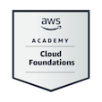
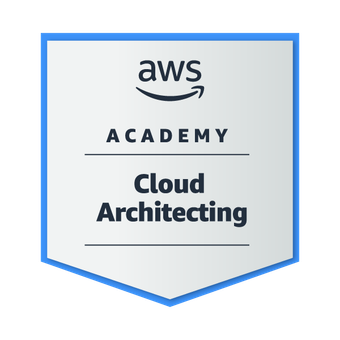

Me chamo Carlos Holanda e esse é o meu perfil no github!

Atualmente trabalho no Senai-PE como competidor da World Skills edição Shangai 2026 na modalidade computação em nuvem, 
juntamente curso ciências da computação na Faculdade Nova Roma.

Conclui três certificações da AWS e possuo essas badges.
 
    
 

